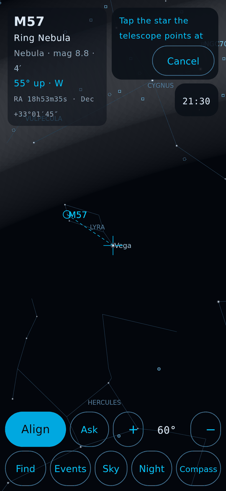
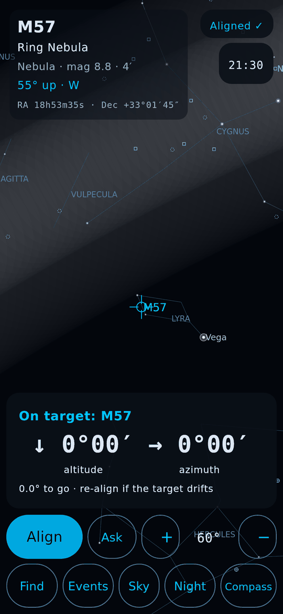
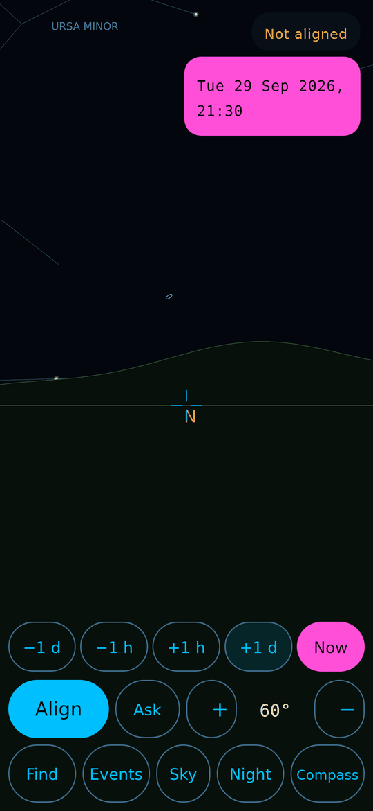
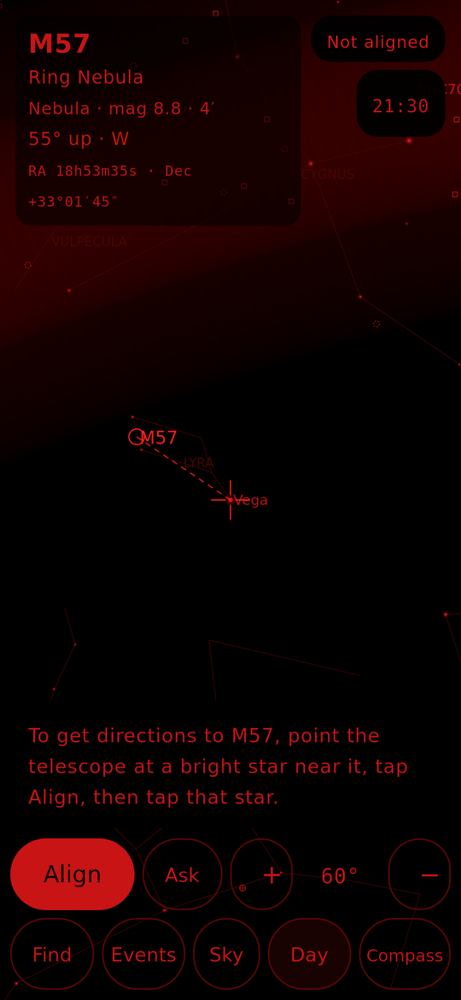
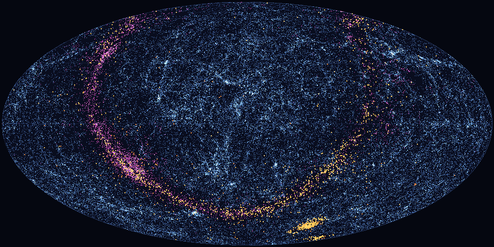

<p align="center">
  
</p>

<h1 align="center">AstroFixxer</h1>

<p align="center">
  <b>Strap your phone to a telescope. Tap a star. Follow the arrows. Find anything.</b><br>
  An offline star-hopping guide and Stellarium-style planetarium for Android.
</p>

<p align="center">
  
  
  
  
</p>

<p align="center">
  <a href="https://github.com/Zenithquonta/astrofixer-baby/releases/download/android-latest/AstroFixxer.apk"></a>
</p>

## Download

1. On your Android phone (Android 8 or newer), tap **[AstroFixxer.apk](https://github.com/Zenithquonta/astrofixer-baby/releases/download/android-latest/AstroFixxer.apk)**. It is rebuilt automatically whenever the app changes.
2. Open the downloaded file. If Android asks, allow your browser or Files app to **install unknown apps**.
3. Open AstroFixxer and allow location, so the sky matches where you are.

New builds install over the old one and keep your lists.

What changed in each update, including every bug fix, is in **[CHANGELOG.md](CHANGELOG.md)**.

---

## How it works

Most telescopes have no motors and no computer. You push them around by hand, and finding a faint galaxy means
**star-hopping**: start at a star you can see, then hop from star to star until you land on the target.
AstroFixxer does the hopping maths for you.

| 1. Point at a bright star, tap it | 2. Follow the arrows | 3. You're on target |
|:---:|:---:|:---:|
|  |  |  |
| The phone's sensors know roughly where it points. Tapping the star the telescope is really on fixes the rest. | Up/down and left/right, in degrees, until both numbers are near zero. | The Ring Nebula is in the eyepiece. |

## What's inside

- 🌌 **About 100,000 objects that need no internet**: stars, galaxies, nebulae, clusters, planets, comets and asteroids, built from [Stellarium](https://stellarium.org)'s open catalogues and the HYG star database.
- 🔭 **Push-to guidance** for manual telescopes, with one-star alignment, a Compass mode, and a Manual mode for phones without a compass.
- 🗓️ **Events for the next 60 days, all worked out on the phone**: eclipses, meteor showers, conjunctions, supermoons, planet gatherings, Mercury and Venus transits, occultations of bright stars by the Moon, bright comets, visible passes of the ISS and the Tiangong space station, and ISS crossings of the Sun and Moon.
- ⏳ **Time travel**: step the sky by hours or days, or jump straight to any event.
- 🏞️ **A Stellarium-style sky**: twilight colours, the Milky Way, landscapes, a light-pollution slider, and Western and Indian (Vedic) constellations with artwork.
- 🎙️ **AstroGuide**, a voice assistant in English and Hindi: *"find Jupiter"*, *"what is M31"*, *"मंगल कहाँ है"*.
- 🔴 **Night mode**: everything turns red, so your eyes stay dark-adapted.

| Events | Time travel | Night mode | हिन्दी |
|:---:|:---:|:---:|:---:|
|  |  |  |  |

## Every dot is something it can find

<p align="center"></p>

That's all **93,997 deep-sky objects** in the app, plotted on one map of the whole sky:
<span>🔵 galaxies</span>, <span>🩷 nebulae</span> and <span>🟡 star clusters</span>.

<details>
<summary><b>Why is there an empty arc through the galaxies?</b></summary>

<br>That arc is our own galaxy. The Milky Way's disc is full of dust, and the dust hides the galaxies behind it.
Astronomers call this the *zone of avoidance*. The nebulae and star clusters crowd along the same arc for the
opposite reason: they are *part* of the Milky Way. The bright clump at the bottom is the Large Magellanic Cloud, a
neighbouring galaxy full of its own clusters.

No one drew that arc. It appears by itself when you plot the catalogue (`tools/repo-art/sky_map.py` in the Android repository).
</details>

## Meet Hop


**Hop** is AstroFixxer's mascot, a star-hopper by trade.

Look closely at the forehead: that's a **red headlamp**. Real astronomers read their charts by red light because it
doesn't undo the half-hour your eyes need to adapt to the dark. That's also why the app has a night mode.

In the banner, Hop does what the app does: lines up on a bright guide star (ringed in pink), follows the dotted guide
line from star to star, and ends up under a faint galaxy while the reticle locks on.

<br clear="right">

## Proof it works

Every push runs:

| Check | What it proves |
|---|---|
| `./gradlew test` (app) | Astronomy maths matches the original web app to 1e-9, SGP4 matches Vallado's published test case, and 2026's eclipses, equinoxes and sunrises land within minutes of published times. |
| `tools/desktop-check` journeys | The real Compose screens, driven by simulated taps: tutorial, find, align, guide, cancel, Back button, time travel, events, night mode, Hindi, lists, manual location. |
| `tools/desktop-check` audit | Every screen in English and Hindi, day and night, on 360 dp and 411 dp phones: controls at least 48 dp, no clipped or overlapping text, and colour contrast of at least 4.5:1 by day (3:1 for night mode's dim red). |

The screenshots in this README are produced by those tests.

## Where things are

This repository holds the plan, the fixed web app and the data tools. The Android app has its own repository,
`Zenithquonta/astrofixxer-android`. Until that repository is reachable, its full history is saved here as a git bundle.

| What | Where |
|---|---|
| Android app (Kotlin + Jetpack Compose), full history | `handoff/astrofixxer-android.bundle`: `git clone handoff/astrofixxer-android.bundle astrofixxer-android` |
| Fixed web app (PWA) | `web/` |
| Stellarium offline data importer | `tools/stellarium_import/` |
| Implementation plan | `docs/IMPLEMENTATION_PLAN.md` |
| Handoff log (updated after every change) | `docs/HANDOFF.md` |
| UI brief for Stitch | `docs/STITCH_UI_PROMPT.md` |
| Field test protocol | `docs/FIELD_TEST.md` |

## Build it yourself

You don't need any accounts, keys or secrets. Get the Android app's source from this repository, then build it:

```sh
git clone https://github.com/Zenithquonta/astrofixer-baby.git
git clone --branch main astrofixer-baby/handoff/astrofixxer-android.bundle astrofixxer-android
cd astrofixxer-android     # open this folder in Android Studio and press Run, or use Gradle:
./gradlew installPreview   # builds the app and installs it on a connected phone (JDK 17 + Android SDK)
```

AstroFixxer is free software under the GPL v3. You may change it and share your own version, as long as it stays GPLv3 with
its source available and keeps the credits below. The Android app's `README.md` and `CONTRIBUTING.md` have the details.

Other commands in the Android app:

```sh
./gradlew test assembleDebug                 # JDK 17 and Android SDK 35; APK in app/build/outputs/apk/debug
(cd tools/desktop-check && ./gradlew test)   # UI journeys and audit; screenshots in tools/desktop-check/build/screens
python3 tools/repo-art/make_art.py           # regenerates the pixel art (needs Pillow)
```

Releasing to Google Play (signing, secrets, store listing, privacy policy) is described in the Android repository's README.

## Credits and licence

GPLv3, as AstroHopper requires. Made for Smart India Hackathon 2025.

- Based on **AstroHopper** by Artyom Beilis (GPLv3): source at [github.com/artyom-beilis/skyhopper](https://github.com/artyom-beilis/skyhopper), app at [artyom-beilis.github.io/astrohopper.html](https://artyom-beilis.github.io/astrohopper.html). AstroFixxer started as a fork of it for Smart India Hackathon 2025, and the pointing, alignment and position maths follow its design.
- Deep-sky catalogue, names, meteor showers and comet orbits come from Stellarium (GPL-2.0-or-later). The sky cultures come from Stellarium (CC BY-SA 4.0), and the constellation artwork is under the Free Art License. Star positions come from the HYG database (CC BY-SA).
- The planet series (VSOP87, via vsop87-multilang) and the position reduction (CPReduce) are by Greg Miller and are in the public domain (in the Android app's `astro/vsop87/`).
- The Android app's golden test values were generated from the web app's own code (`tools/golden/`).
- Hop and the pixel art are original, drawn in code (`tools/repo-art/` in the Android repository).
